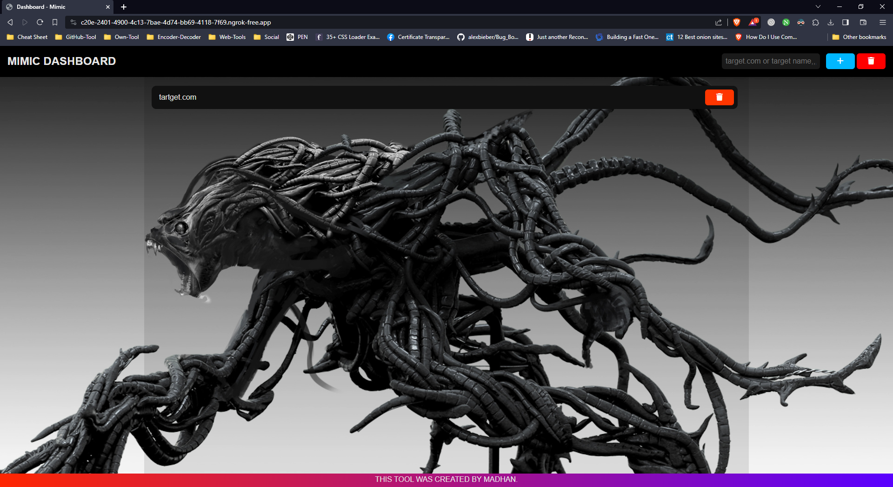
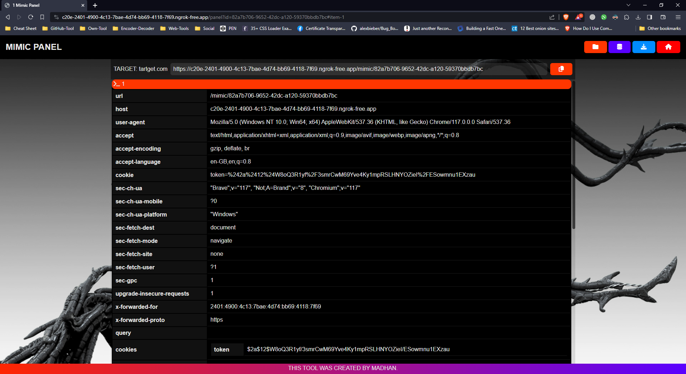
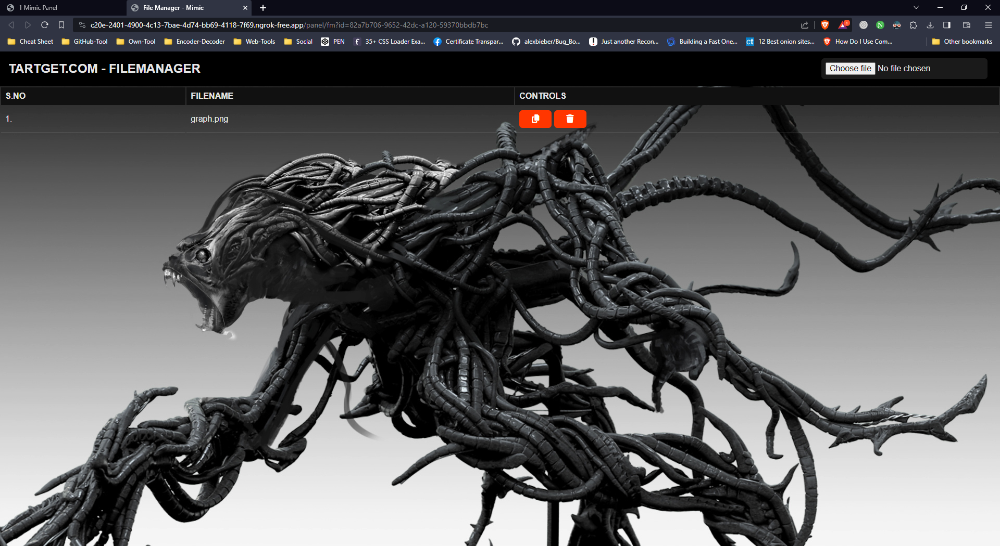

# MIMIC

- MIMIC HUNTER FOR BUG HUNTING. THIS IS A REQUEST HUNTING TOOL.



## Installation & Usage

Install MIMIC with GIT

```bash
git clone https://github.com/madhanmaaz/mimic
```
```bash
cd mimic
```
- install dependencies
```bash
npm i
```
- run
```bash
npm run start
```
## Screenshots





